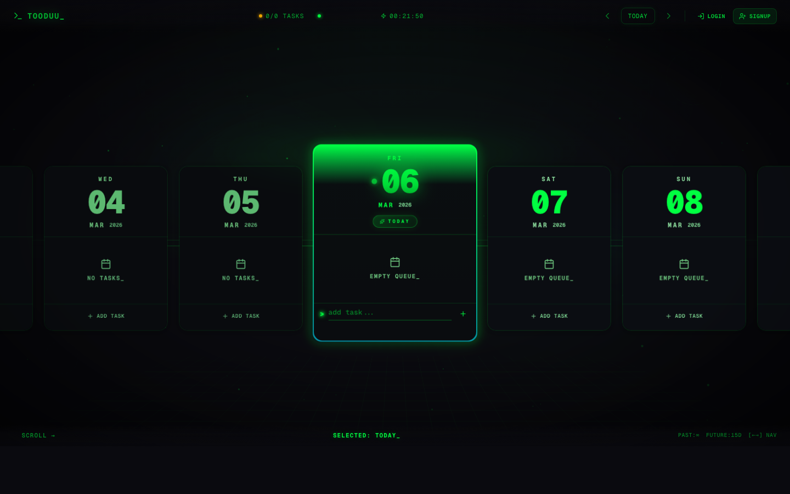

<div align="center">

# ⚡ TOODUU

### A Retro-Terminal Futuristic Todo Timeline

[](https://tooduu.srv1302879.hstgr.cloud)
[](https://nextjs.org/)
[](https://www.typescriptlang.org/)
[](https://tailwindcss.com/)
[](https://docker.com)
[](https://github.com/yatindma/TooDuu)
[](LICENSE)

<br/>

**The todo app that makes you WANT to be productive.**

Horizontal scrollable timeline · Retro terminal aesthetic · 5-layer parallax · Local-first with optional auth

<br/>

[🔴 Live Demo](https://tooduu.srv1302879.hstgr.cloud) · [Report Bug](https://github.com/yatindma/TooDuu/issues) · [Request Feature](https://github.com/yatindma/TooDuu/issues)

</div>

---

## 📸 Preview

<div align="center">

<!-- Replace with GIF for maximum impact: gifcap.dev or Kap (macOS) -->


<br/>
<sub><i>Horizontal timeline with glowing selected card, parallax SVG background, and terminal-style UI</i></sub>

</div>

---

## 🤔 Why TOODUU?

Every developer has built a todo app. None of them look like this.

- **Not another boring todo list** — it's a horizontal timeline you scroll through like a sci-fi interface
- **Visual dopamine** — 5-layer parallax, animated glowing borders, mouse-following light, neon everything
- **Actually useful** — works without signup (localStorage), optional auth syncs across devices

> Think of it as if someone from 2087 traveled back in time and built a todo app using terminal technology.

---

## 🖥️ What is TOODUU?

TOODUU is a **horizontal-scrolling todo timeline** wrapped in a retro-terminal aesthetic. Navigate through past and future dates, add tasks, and watch your productivity unfold across a sci-fi command line interface.

---

## ✨ Features

<table>
<tr>
<td width="50%">

### 🎯 Core
- **Infinite Timeline** — Scroll left for infinite past, 15 days future
- **Smart Scroll** — Mouse wheel → horizontal; vertical inside todo lists
- **Keyboard Nav** — Arrow keys to navigate, `T` for today
- **CRUD** — Add, complete, delete tasks per date
- **Blinking Cursors** — Terminal-style blink effects everywhere

</td>
<td width="50%">

### 🎨 Design
- **5-Layer Parallax** — Stars, nebula, grid, particles, HUD rings
- **Mouse-Following Glow** — Radial light tracks your cursor
- **Animated Borders** — Rotating gradient glow on selected card
- **Neon Typography** — Gradient text with drop-shadow glow
- **Terminal Green** — `#00ff41` on dark `#0a0a0f` background

</td>
</tr>
<tr>
<td width="50%">

### 🔐 Auth System
- **Works Without Login** — localStorage for anonymous users
- **Optional Accounts** — Register/login with email + password
- **Data Migration** — Prompts to move local todos on signup
- **JWT + Cookies** — Secure httpOnly auth tokens
- **Password Toggle** — Show/hide password in auth modal

</td>
<td width="50%">

### 🚀 Technical
- **Next.js 16** — App Router with Turbopack
- **SQLite** — Zero-config, file-based via better-sqlite3
- **Docker Ready** — Multi-stage build, Traefik labels
- **Optimistic Updates** — Instant UI, async API calls
- **WAL Mode** — Better concurrent SQLite access

</td>
</tr>
</table>

---

## 🛠️ Tech Stack

```
Frontend     → Next.js 16 (App Router) + TypeScript + Tailwind CSS 4
Animations   → Framer Motion + CSS keyframes
Icons        → Lucide React
Auth         → JWT (jose) + httpOnly cookies + bcryptjs
Database     → SQLite (better-sqlite3) — zero config, file-based
Deployment   → Docker + Traefik reverse proxy + Let's Encrypt SSL
```

---

## ⚡ Quick Start

### Local Development

```bash
git clone https://github.com/yatindma/TooDuu.git
cd TooDuu
npm install
npm run dev
```

Open [http://localhost:3000](http://localhost:3000) — that's it. No database setup. SQLite creates itself.

### Docker

```bash
docker compose up -d --build
```

---

## 📐 Architecture

```
┌─────────────────────────────────────────┐
│              Browser                     │
│  localStorage (anonymous)               │
│  OR API calls (authenticated)           │
└──────────────┬──────────────────────────┘
               │
   ┌───────────▼───────────┐
   │   Next.js 16 Server   │
   │                       │
   │  /api/auth/login      │
   │  /api/auth/register   │
   │  /api/auth/me         │
   │  /api/auth/logout     │
   │  /api/todos (CRUD)    │
   │         │             │
   │  ┌──────▼──────┐     │
   │  │   SQLite    │     │
   │  │  (WAL mode) │     │
   │  └─────────────┘     │
   └───────────────────────┘
```

---

## 📂 Project Structure

```
src/
├── app/
│   ├── api/
│   │   ├── auth/               # login, register, me, logout
│   │   └── todos/              # GET, POST, PATCH, DELETE
│   ├── globals.css             # Terminal theme + keyframe animations
│   ├── layout.tsx              # Root layout with AuthProvider
│   └── page.tsx                # Main timeline page
├── components/
│   ├── auth-modal.tsx          # Login/Register modal
│   ├── date-card.tsx           # Individual date card with todos
│   ├── migrate-modal.tsx       # localStorage → DB migration prompt
│   └── terminal-background.tsx # 5-layer parallax SVG background
├── hooks/
│   └── use-todos.ts            # Smart hook: API or localStorage
└── lib/
    ├── auth-context.tsx        # Auth provider + hooks
    ├── db.ts                   # SQLite schema + connection
    ├── get-user.ts             # Server-side JWT verification
    └── types.ts                # Todo, DayData types
```

---

## 🐳 Deployment

TOODUU runs on Docker with Traefik as reverse proxy:

```yaml
# docker-compose.yml highlights
services:
  tooduu:
    build: .
    labels:
      - "traefik.enable=true"
      - "traefik.http.routers.tooduu.rule=Host(`your-domain.com`)"
      - "traefik.http.routers.tooduu.tls.certresolver=letsencrypt"
    volumes:
      - tooduu-data:/app/data  # Persistent SQLite
```

---

## 🤝 Contributing

Contributions are welcome! Feel free to:

1. Fork the project
2. Create your feature branch (`git checkout -b feat/amazing-feature`)
3. Commit changes (`git commit -m 'feat: add amazing feature'`)
4. Push to branch (`git push origin feat/amazing-feature`)
5. Open a Pull Request

---

## 📌 Versioning

This project follows [Semantic Versioning](https://semver.org/) (`MAJOR.MINOR.PATCH`):

| Bump | When | Example |
|------|------|---------|
| `PATCH` (0.1.X) | Bug fixes | `fix: blinking time display` |
| `MINOR` (0.X.0) | New features | `feat: add calendar view` |
| `MAJOR` (X.0.0) | Breaking changes | UI overhaul, API redesign |

**Current version: `0.2.0`** (pre-launch)
v1.0.0 will be tagged at public launch.

---

## 📄 License

MIT — do whatever you want with it.

---

<div align="center">

### If this made you go "damn, that's cool" — [drop a star](https://github.com/yatindma/TooDuu). It takes 1 second and helps others find it.

**Built with terminal green and an unhealthy amount of caffeine**

*by [Yatin Arora](https://github.com/yatindma) — AI Engineer based in Frankfurt · [LinkedIn](https://linkedin.com/in/yatin-arora)*

</div>
